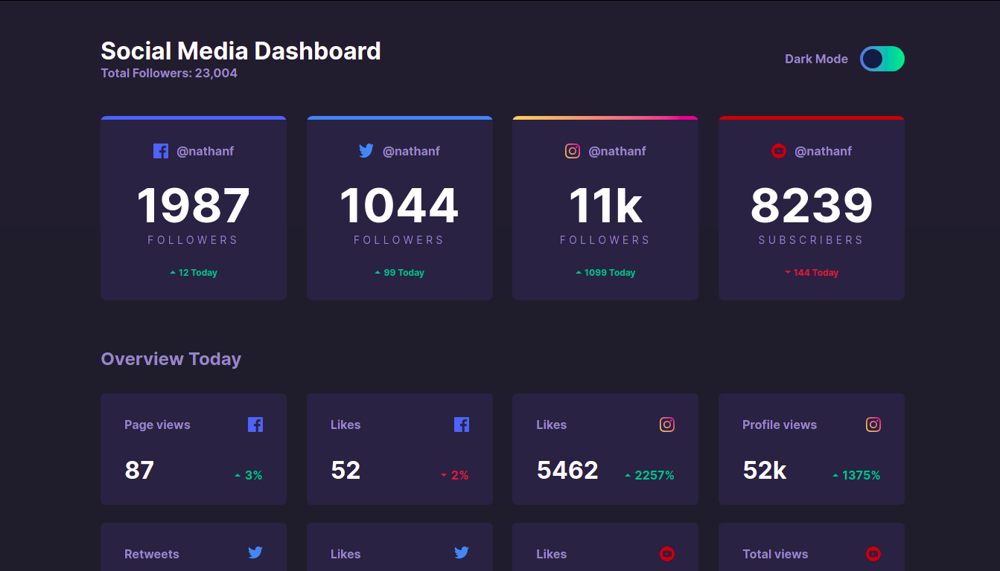
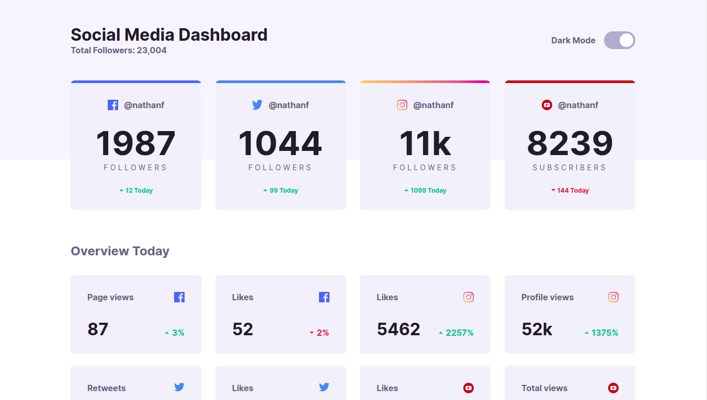

# Social media dashboard

This is a solution to the Social media dashboard with theme switcher challenge on Frontend Mentor. 

## Table of contents

- [Overview](#overview)
  - [The challenge](#the-challenge)
  - [Screenshot](#screenshot)
  - [Links](#links)
- [My process](#my-process)
  - [Built with](#built-with)
- [Author](#author)

## Overview
### The challenge

Users should be able to:

- View the optimal layout for the site depending on their device's screen size
- See hover states for all interactive elements on the page
- Toggle color theme to their preference

### Screenshot
> Dark Mode

> Light Mode

### Links

- [Solution](https://www.frontendmentor.io/solutions/a-social-media-dashboard-using-html-and-scss-rJeYreVrc)
- [Live Site](https://social-dash-vaib.netlify.app/)

## My process

### Built with

- Semantic HTML5 markup
- SCSS
- Vanilla JS

## Author
<a href="https://vaib.carrd.co">Vaibhav Kumar Singh</a>